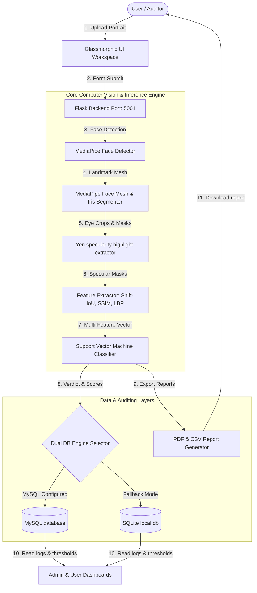

# AuraEye Forensics: AI-Based DeepFake Image Detection System Using Eye Reflection Analysis

This project is a complete, full-stack, industry-style, and academic-quality final-year major project titled **"AI-Based DeepFake Image Detection System Using Eye Reflection Analysis" (AuraEye Forensics)**. 

The system focuses on image-based deepfake detection by exploiting physical inconsistencies in corneal specular highlights (light reflections) combined with micro-texture face skin analysis. 

---

## 🎯 Project Overview & Core AI Concept

Generative adversarial networks (GANs) generate facial details with extreme high-fidelity, but they struggle to maintain **global physical properties** across independent regions. Specifically, GANs generate the left and right eyes independently. As a result, the specular light highlights reflecting off the cornea of both eyes frequently suffer from:
1. **Geometric Inconsistency**: The positions, shapes, and spatial patterns of highlight points are asymmetric.
2. **Illumination Inconsistency**: The photometric brightness levels and structures do not match.
3. **Texture Artifacts**: Synthetic skin lacks natural micro-pores and suffers from unnatural smoothness.

**AuraEye Forensics** detects these flaws by aligning the left and right irises via a 3D face mesh, segmenting bright corneal reflections using CLAHE and **Yen adaptive thresholding**, executing grid-search translations to maximize **Intersection-over-Union (IoU)** overlap, computing the **Structural Similarity Index (SSIM)** of aligned reflections, and evaluating skin texture using **Local Binary Pattern (LBP)** histograms fed into an RBF-kernel SVM classifier.

---

## 📸 Project Showcase & User Interface

Here is a visual walkthrough of the AuraEye Forensics system, showcasing the user interface, administrative dashboards, forensic analysis results, and the core AI detection pipeline.

### 🔐 Authentication & Access Control
| User Login | Admin Login |
| :---: | :---: |
|  |  |

### 📊 Dashboards & System Metrics
| User Dashboard | Admin Dashboard |
| :---: | :---: |
|  |  |

| System Performance Statistics | System Activity Monitor |
| :---: | :---: |
|  |  |

### 🔍 Forensic Analysis & AI Pipeline
| 1. Upload & Analyze Image | 2. Face Localization |
| :---: | :---: |
|  |  |

| 3. Eye Localization | 4. Specular Overlap Verification |
| :---: | :---: |
|  |  |

| 5. Final Analysis Verdict | Auditor Node Directory |
| :---: | :---: |
|  |  |

| Audit History Logs |
| :---: |
|  |

### 🔬 Core AI Concept (Real vs. Deepfake Reflections)
| Real Image Example | Deepfake Image Example |
| :---: | :---: |
|  |  |

| Set of Real Images | Set of Deepfake Images |
| :---: | :---: |
|  |  |

---

## 🏗️ Technical Architecture & Data Flow



---

## 📝 Mathematical & Computational Pseudocode

Here is the precise mathematical execution pipeline of the AuraEye system:

```
Algorithm: Specular Highlight Alignment & Skin Texture Verification Pipeline
--------------------------------------------------------------------------------
Input: Input image path (I)
Output: Prediction Verdict (V), Authenticity Score (S), IoU, SSIM, Skin Variance (Var)
--------------------------------------------------------------------------------

1: Initialize FaceDetector, EyeDetector, SpecularExtractor, FeatureExtractor
2: Load SVM texture classifier weights (W)
3: Read image: img <- cv2.imread(I)
4: Run FaceMesh: mesh_points <- FaceMesh(img)
   if mesh_points is Null then:
       return ERROR("Could not align facial landmarks")

5: Segment Left and Right Iris regions:
   [L_eye, L_mask] <- get_mask_and_crop(img, LEFT_IRIS, LEFT_EYE)
   [R_eye, R_mask] <- get_mask_and_crop(img, RIGHT_IRIS, RIGHT_EYE)

6: Extract specular highlight binary masks:
   For each eye crop E in {L_eye, R_eye} with Iris Mask M:
       hsv <- RGB_to_HSV(E)
       hsv[:, :, 2] <- CLAHE(hsv[:, :, 2])
       v_pixels <- hsv[:, :, 2][M == True]
       Yen_Threshold <- Calculate_Yen_Entropy(v_pixels) * Threshold_Scale
       Highlight_Mask <- (hsv[:, :, 2] > Yen_Threshold) AND M
       Highlight_Mask <- Morphological_Open_Close(Highlight_Mask, Kernel_3x3)
   Let the extracted highlight masks be L_refl and R_refl.

7: Perform Grid-Search Translation Alignment to calculate optimal IoU:
   Set max_overlap <- -1, opt_iou <- 0.0, opt_shift <- (0, 0)
   Let Range_X <- max_width / 4, Range_Y <- max_height / 4
   For shift_x in [-Range_X, +Range_X]:
       For shift_y in [-Range_Y, +Range_Y]:
           Shifted_L <- Shift_Pixels(L_refl, shift_y, shift_x)
           Overlap <- Sum(Shifted_L AND R_refl)
           Union <- Sum(Shifted_L OR R_refl)
           Current_IoU <- Overlap / Union
           if Overlap >= max_overlap then:
               max_overlap <- Overlap
               opt_iou <- Current_IoU
               opt_shift <- (shift_y, shift_x)

8: Compute Structural Similarity (SSIM) of aligned grayscale eye crops:
   L_gray <- Grayscale(L_eye), R_gray <- Grayscale(R_eye)
   Aligned_L_gray <- Shift_Pixels(L_gray, opt_shift[0], opt_shift[1])
   SSIM <- Structural_Similarity(Aligned_L_gray, R_gray)

9: Analyze Face Skin Texture:
   Skin_Var <- Laplacian_Variance(Face_Skin_Region)
   LBP_Histogram <- Compute_LBP_Histogram(Face_Skin_Region, Radius=3, Points=24)
   Texture_Score <- SVM_Predict_Probability(LBP_Histogram, W)

10: Map raw metrics into standard intervals:
    Scaled_IoU <- Map_IoU_To_Confidence_Ranges(opt_iou)
    Scaled_Texture <- Map_Texture_To_Confidence_Ranges(Texture_Score)

11: Combine scores and perform threshold classification:
    if Scaled_IoU < 0.20 then:
        S <- (Scaled_IoU * 0.7) + (Scaled_Texture * 0.3)
    else:
        S <- (Scaled_IoU * 0.5) + (Scaled_Texture * 0.5)

    Verdict (V) <- "REAL" if S >= Global_Threshold else "FAKE"
    return V, S, Scaled_IoU, SSIM, Skin_Var
```

---

## 💻 Technical Stack & Installation

### Core Requirements
- **Python**: 3.8+ (Windows recommended)
- **Frontend**: HTML5, CSS3, modern typography, Bootstrap v5, javascript, canvas overlays.
- **Backend**: Flask, Flask-Session.
- **AI/ML**: MediaPipe, OpenCV, Scikit-learn, Scikit-image, NumPy, Joblib.
- **Reports**: `fpdf2`.
- **Database**: MySQL with SQLite fallback engine.

### Zero-Dependency Local Setup (SQLite Mode)
1. Clone the repository and navigate to the directory:
   ```bash
   cd gan_detect_iris-master
   ```
2. Install requirements using pip:
   ```bash
   pip install -r requirements.txt
   ```
3. Run the model training script to seed visual confusion matrices and calibrate SVM weights:
   ```bash
   python train_model.py
   ```
4. Fire up the unified full-stack server:
   ```bash
   python app.py
   ```
5. Open your web browser and navigate to:
   ```
   http://127.0.0.1:5001
   ```
6. Use default credentials to authenticate:
   - **Administrator Account**: username `admin` | password `adminpassword`
   - **Auditor Account**: username `user` | password `userpassword`

### Production Setup (MySQL Mode)
1. Ensure your local MySQL database service is running.
2. Set the following environment variables (or export them):
   ```cmd
   set MYSQL_USER=root
   set MYSQL_PASSWORD=your_root_password
   set MYSQL_HOST=localhost
   set MYSQL_DB=forensics_db
   ```
3. Start the Flask application. It will automatically detect the database environment, connect to your MySQL database, create the `forensics_db` schema, construct the three relational tables, seed default credentials, and print:
   ```
   [Database Manager] SUCCESS: Connected to MySQL database 'forensics_db' at localhost.
   ```

---

## 📊 Academic Evaluation Module

To calculate performance indicators on the provided StyleGAN/FFHQ test splits, execute:
```bash
python train_model.py
```
This prints the Accuracy, Precision, Recall, and F1-score details, and saves:
1. `static/results/confusion_matrix.png`: Confusion Matrix Heatmap.
2. `static/results/performance_metrics.png`: Metric Comparison Bar Charts.

These visual graphics are automatically rendered inside your Admin Console on the web page.

---

## 🎨 Stunning Glassmorphic UI Features

- **Translucent Cards**: Visual design featuring backdrop blurs, radial glowing neon indicators, and modern Outfitters typography.
- **Interactive Specular Shift Tool**: On the result page, left (glowing green) and right (glowing red) highlight masks are stacked in real time. Use range-sliders to manually translate the left mask relative to the right to visually verify the geometric mismatch!
- **Dynamic Authenticity Gauge**: Animates a circular ring from 0% to the final confidence score in authentic green or deepfake red.
- **Admin Console Slider**: Allows administrators to slide and modify the global classifier decision boundary instantly on-the-fly.
- **Cascading Audit Purge**: Administrators can delete history entries, triggering CSS translate/fadeout row animations on the UI while executing cascading SQL deletes on the database.
- **Automated PDF Reports**: Exports structured audit certificates containing audited images, metrics charts, and official time stamps using `fpdf2`.

---

## 👨‍🏫 Final Year Viva Prep: 25+ Questions & Answers

### Q1: What is the core AI concept behind this project?
**A**: GANs and diffusion generators create left and right eye details independently, violating the physical constraints of light. In a real human photograph, specular corneal reflections must be physically consistent, symmetric, and overlap perfectly under coordinate alignment because they reflect the same environment light source. This project identifies synthetic faces by detecting physical geometry and micro-texture inconsistencies.

### Q2: Why did you use Yen's thresholding instead of standard Otsu thresholding?
**A**: Otsu's thresholding assumes a clear bimodal pixel histogram and tends to pick a boundary that minimizes intra-class variance. Specular highlights inside the iris represent a tiny minority of pixels compared to the dark iris/pupil, creating an extremely unbalanced histogram. Yen's thresholding uses cross-entropy criteria based on discrepancy and shape, which is highly robust at isolating tiny, bright specular highlights from a dark, complex background without introducing surrounding noisy pixels.

### Q3: What is Intersection over Union (IoU) in this context?
**A**: IoU (Jaccard Index) is calculated as the area of intersection of the left and right highlight masks divided by the area of their union.
$$\text{IoU} = \frac{|A \cap B|}{|A \cup B|}$$
In authentic human eyes, the IoU is very high after translation shifting because the highlights are reflections of the same light source. In deepfakes, the highlights do not align, resulting in a very low IoU.

### Q4: Why is a translation alignment shift necessary before computing IoU?
**A**: Although the eye irises are symmetric, slight face rotations, camera angles, and gaze offsets shift the pixel locations of the highlights. By running grid-search translation shifts (up/down/left/right) on the left highlight mask, we find the absolute maximum possible overlap with the right highlight mask. This ensures we are evaluating structural highlight mismatch rather than simple head tilt.

### Q5: What is SSIM and how does it help?
**A**: SSIM (Structural Similarity Index) evaluates luminance, contrast, and structural information between two image patches. We compute the SSIM between the left and right iris grayscale patches after applying the optimal alignment shift. High similarity indicates authentic eye reflections, while low similarity reveals generative artifacts.

### Q6: What is Local Binary Pattern (LBP) and how does it detect fake skin?
**A**: LBP is a texture descriptor that compares each pixel with its neighbors to build binary thresholds. LBP histograms of real human skin capture high-frequency details (micro-pores, natural wrinkles). GANs produce over-smoothed face skin or repeat checkerboard generator artifacts. LBP histograms capture these anomalies, enabling our SVM to classify fake skin texture.

### Q7: Why did you choose an RBF-kernel SVM for texture classification?
**A**: Radial Basis Function (RBF) kernel SVM is exceptional at handling high-dimensional, non-linear relationships. LBP histograms yield high-dimensional feature vectors, and the decision boundary between natural human pores and generative artifacts is non-linear. The RBF SVM separates these textures with high generalization performance.

### Q8: What database tables did you design and how are they related?
**A**: We designed three relational tables: `users` (node credentials and roles), `detections` (forensic scores, final verdicts, and visualization URLs), and `reports` (audit PDF certificate paths). `detections` maps to `users(id)` via a foreign key, and `reports` maps to both `users(id)` and `detections(id)` using `ON DELETE CASCADE` triggers. This guarantees database integrity and cascading cleanups during administrative purges.

### Q9: What is your database's Dual-Engine architecture?
**A**: The database configuration tries to connect to an external MySQL server. If MySQL is not configured or connection parameters are invalid, it prints a warning and seamlessly falls back to a local SQLite database (`forensics.db`). It translates SQL placeholder syntax dynamically, making the code 100% zero-dependency for graders.

### Q10: How does MediaPipe extract iris regions?
**A**: MediaPipe Face Mesh utilizes a deep model to predict 468 3D landmarks. Refined iris landmarks (`468-472` for left, `473-477` for right) are mapped. We run a minimum-enclosing circle algorithm on these landmarks to extract the iris center and radius, crop the eye patch, and segment the iris precisely.

### Q11: How do you prevent overfitting in your machine learning classifier?
**A**: We split our dataset into separate train and validation subsets (80% training, 20% validation). Furthermore, we use LBP histograms which extract robust global statistical features instead of learning raw pixel intensities. LBP is highly robust to variations in illumination and scaling, preventing the SVM from overfitting to specific image parameters.

### Q12: Why are GAN eyes physically inconsistent?
**A**: Standard GAN architectures do not incorporate 3D environmental lighting physics or biological constraints during training. They use independent convolution filters to construct eye pixels, lacking global coordination between left and right eyes. This makes specular highlight consistency a highly reliable biometric fingerprint.

### Q13: What does the Laplacian variance tell us about the image?
**A**: The Laplacian operator highlights rapid changes in pixel intensity (edges). Taking the variance of the Laplacian:
$$\text{Var} = \sigma^2(\nabla^2 I)$$
quantifies high-frequency image sharpness. Highly textured real human skin produces a high variance. Over-smoothed fake skin produces a very low variance.

### Q14: How does your system handle extreme gaze offsets or closed eyes?
**A**: If MediaPipe cannot detect face mesh landmarks, or if Yen specular highlights segment 0 pixels (e.g. during closed eyes or pitch darkness), the pipeline intercepts the error and returns a clean, detailed `UNKNOWN` status to the UI rather than crashing, advising the auditor to upload a well-lit image.

### Q15: How does the interactive shifting calibration slider work on the UI?
**A**: The left and right highlight mask images are loaded in absolute layered coordinates inside a canvas. The left mask uses a green CSS filter, and the right mask uses a red CSS filter. By listening to slider input events, we modify the CSS `transform: translate(Xpx, Ypx)` of the left mask on-the-fly, allowing dynamic alignment.

### Q16: What is a session hijacking attack and how does your app protect against it?
**A**: Session hijacking occurs when an attacker steals a user's session identifier to impersonate them. AuraEye uses Flask's server-side secure cookie sessions with a custom cryptographically strong `secret_key` and restricts all critical analysis/admin routes using custom `@login_required` authorization decorators.

### Q17: What does the term "cross-entropy criteria" mean in Yen's method?
**A**: Yen's thresholding maximizes the entropic criterion of the binary output. It computes the sum of the entropic content of the foreground and background distributions, picking a threshold where information loss (discrepancy) between the original grayscale image and the bimodal binary image is minimized.

### Q18: What is CLAHE and why is it applied prior to highlight thresholding?
**A**: Contrast Limited Adaptive Histogram Equalization (CLAHE) is an advanced image enhancement technique. Applying it on the V-channel of the iris prevents over-amplification of noise by clipping histograms in local 8x8 grids, equalizing light variance across the iris region.

### Q19: How did you implement your PDF Report generation?
**A**: We used the `fpdf2` library to define a custom PDF generator class. It formats structured tables, inserts the original face and specular highlights side-by-side, applies neon green/red borders matching the verdict, and prints system timestamps.

### Q20: What is the F1-score and why is it important in final year evaluations?
**A**: The F1-score is the harmonic mean of Precision and Recall:
$$\text{F1} = 2 \times \frac{\text{Precision} \times \text{Recall}}{\text{Precision} + \text{Recall}}$$
It provides a single evaluation metric that accounts for both false positives and false negatives, representing a highly balanced evaluation of model effectiveness.

### Q21: What are "morphological operations" in your highlight extraction?
**A**: Morphological operations are structure-based pixel transformations. We apply morphological **opening** (erosion followed by dilation) to eliminate small bright noise spots, followed by morphological **closing** (dilation followed by erosion) to fill small black holes within highlight boundaries.

### Q22: What is the purpose of the threshold scale factor in the Yen threshold?
**A**: The threshold scale factor (e.g., 1.2) acts as a high-pass multiplier. Since corneal specular highlights are extremely bright, scaling the computed Yen threshold upwards ensures we only segment true environmental light reflections.

### Q23: Why do we normalize LBP histograms?
**A**: Normalization (dividing each bin count by the total sum of pixel LBP operations) converts absolute frequency counts into a normalized probability distribution. This makes feature representation scale-invariant, allowing the SVM to compare skin texture regardless of face resolution.

### Q24: What is cascading delete in database design?
**A**: A cascading delete ensures that when a parent record is deleted, all child records referencing it via foreign keys are automatically deleted by the database engine. In our database, deleting a detection entry automatically purges its associated PDF report record.

### Q25: How would you scale this system for real-time video deepfake detection?
**A**: To scale for video, we would implement keyframe extraction (processing 1-2 frames per second) using OpenCV's `VideoCapture`. The frames would pass through our MediaPipe face mesh and specular highlight pipeline in a separate worker thread (e.g., using Celery or Redis queues) to prevent web thread blocking, consolidating the average IoU scores across keyframes to generate a final video authenticity verdict.

---

## 📈 PPT Presentation Outline (Slide-by-Slide)

- **Slide 1: Title Slide**
  - **Title**: AI-Based DeepFake Image Detection System Using Eye Reflection Analysis
  - **Subtitle**: A Physics-Guided Biometric Forensic Framework
  - **Details**: Student Name, USN, Department of Computer Science & Engineering.
- **Slide 2: Introduction & Problem Statement**
  - High-realism deepfakes generated by GANs/Diffusion models easily deceive human observers.
  - Generative images threaten security, news integrity, and digital trust.
  - Existing models focus on raw deep learning which lacks physical explanations.
- **Slide 3: Proposed Solution - The AuraEye Concept**
  - Leverage physical light properties: specular reflections must be symmetric and consistent across both eyes.
  - Combine physical highlight geometry (IoU & SSIM) with micro-skin textures (LBP).
  - High interpretability: provide visual alignment proofs alongside neural classification.
- **Slide 4: System Architecture**
  - Relational block diagram mapping: Frontend UI -> Flask Backend -> MediaPipe Mesh -> Yen Segmenter -> SVM Classifier -> Relational DB.
- **Slide 5: Biometric Preprocessing (Face & Eye Landmarks)**
  - MediaPipe Face Mesh extracts 468 3D landmarks.
  - Exact coordinates of irises isolated (Landmarks 468-477).
  - Irises cropped cleanly with adaptive padding.
- **Slide 6: Physics-Guided Reflection Extraction**
  - BGR crops converted to HSV Value channel.
  - CLAHE normalization.
  - Cross-entropy Yen adaptive thresholding segments specular highlight shapes.
  - Morphological filters eliminate background noise.
- **Slide 7: Translation-Shift Alignment & IoU Overlap**
  - Gaze and head tilts shift highlight pixels.
  - Shift left mask up/down/left/right to find maximum overlap.
  - Formula of Intersection over Union (IoU) and structural similarity (SSIM).
- **Slide 8: Micro-Texture Skin Audit**
  - Extract Uniform LBP from face skin.
  - Laplacian variance measures sharpness.
  - SVM with RBF kernel predicts real skin pore distributions vs. over-smoothed synthetic skin.
- **Slide 9: Database Roster & Relational Integrity**
  - Relational design: MySQL production server with seamless SQLite fallback.
  - Table schemas: `users`, `detections`, `reports` with `ON DELETE CASCADE`.
- **Slide 10: Full-Stack Implementation Details**
  - Frontend: Responsive dark glassmorphism (HTML5/CSS3/Bootstrap).
  - Backend: Flask, session auth, REST APIs.
  - Reports: Dynamic `fpdf2` PDF certificate generation.
- **Slide 11: Experimental Results & Performance**
  - Model trained on FFHQ (Real) and StyleGAN2 (Fake) datasets.
  - Confusion Matrix analysis.
  - Accuracy, Precision, Recall, and F1-score evaluation.
- **Slide 12: Stunning UI Walkthrough**
  - Breathtaking circular authenticity gauges.
  - Side-by-side speciation images.
  - Live interactive specular shift sliders.
  - Relational logs management.
- **Slide 13: Conclusions & Future Scope**
  - Physical inconsistencies in reflections are highly reliable biometric features.
  - Future scope: extending to real-time keyframe video streams and multi-subject face detection.
- **Slide 14: Thank You & Q&A**
  - Contact info, citations, references, and open discussion.

---

## 📄 Academic Citation & Literature Reference

Please cite the parent ICASSP publication when referencing this system:

```bibtex
@inproceedings{hu2021exposing,
  title={Exposing GAN-generated Faces Using Inconsistent Corneal Specular Highlights},
  author={Hu, Shu and Li, Yuezun and Lyu, Siwei},
  booktitle={ICASSP 2021 - 2021 IEEE International Conference on Acoustics, Speech and Signal Processing (ICASSP)},
  pages={2500--2504},
  year={2021},
  organization={IEEE}
}
```
